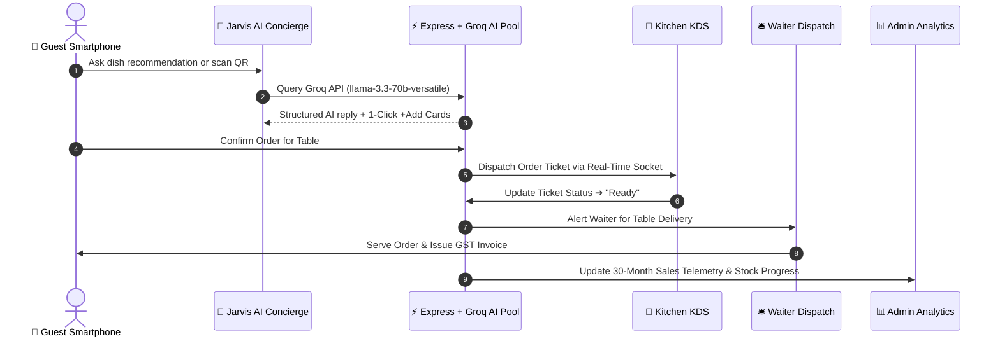

<div align="center">

  <!-- 3D Gold Waving Hero Header -->
  

  <br />

  <h1>✨ AZZURRO CAFFÈ — SMART MANAGEMENT SYSTEM</h1>
  <p><strong>Enterprise Digital Nervous System & AI Culinary Concierge Engine</strong></p>

  <br />

  <!-- Team & Institution Spotlight -->
  <table>
    <tr>
      <td align="center" width="50%">
        🧙‍♂️ <strong>Team Name</strong><br />
        <a href="#"></a>
      </td>
      <td align="center" width="50%">
        🏛️ <strong>Institution</strong><br />
        <a href="#"></a>
      </td>
    </tr>
  </table>

  <br />

  <!-- Animated Tech Badges -->
  <div>
    
    
    
    
    
    
    
    
    
  </div>

</div>

<br />

---

## 💎 Executive Overview

> [!IMPORTANT]
> **Azzurro Caffè (Powered by ORDR Smart OS)** is a flag-ship fine-dining management system built with a gold glassmorphic design system. It combines a 4-Key Groq AI Assistant (*Jarvis*), camera QR table scanner, sub-50ms Kitchen Display System (KDS), waiter mobile dispatching, host stand queue manager, and 30-Month historical revenue analytics into an autonomous restaurant ecosystem.

---

## 🚀 Key Features & Highlights

### 🤖 1. Jarvis AI Virtual Culinary Concierge
- **4-Key Groq LLM Cascade**: Automatically fails over between `llama-3.3-70b-versatile`, `llama-3.1-8b-instant`, and `mixtral-8x7b-32768` to guarantee zero rate-limit downtime.
- **Context-Aware Assistance**: Trained on Azzurro Caffè's signature menu, pricing, allergen profiles, and table routing.
- **1-Click "+ Add to Cart" Recommendation Cards**: Jarvis embeds interactive dish cards directly inside chat bubbles for instant 1-click ordering.

### 📱 2. Live Camera QR Code Scanner (`/scan.html`) & Table Allotment
- Integrated live camera/webcam scanner for table QR codes.
- **Hackathon Judge Phone Demo**: Displays a scannable Table #1 QR code on screen encoding `https://vibeathon6-0.vercel.app/order.html?table=1` for instant smartphone menu ordering.

### 📊 3. 30-Month Financial Telemetry & AI Analytics
- Visual 6-month revenue trend bar graphs, top selling dish velocity leaderboards, 30-month collections tracking, and live ingredient stock progress bars.

### 🎬 4. 3D Rolling Crown Emblem & Circular Clip-Path Reveal
- Features a 3D rolling logo roll keyframe animation and a smooth expanding `clip-path: circle()` mask reveal for `"WELCOME TO AZZURRO CAFFÈ, A SMART MANAGEMENT SYSTEM"`.

---

## 🔐 Staff Portal Quick-Access & Demo Credentials

| Portal | Demo Login Email | Primary Role & Capabilities | Access Route |
| :--- | :--- | :--- | :---: |
| 👑 **Admin / Manager** | `admin@azzurro.demo` | 30-Month revenue bar charts, Groq AI telemetry reports, inventory progress, staff roster | `/login.html` |
| 🍳 **Kitchen KDS** | `kitchen@azzurro.demo` | Touch KDS bump queue, prep timers, itemized ticket dispatching | `/login.html` |
| 🛎️ **Waiter Panel** | `waiter@azzurro.demo` | Table delivery status, ready order dispatching, waiter call alerts | `/login.html` |
| 🪑 **Host Stand** | `host@azzurro.demo` | 12-table floor plan status grid, automated queue allotment, waitlist engine | `/login.html` |
| 📷 **Camera Scanner** | *Public Access* | Live camera QR scanner & smartphone demo table allotment | `/scan.html` |

---

## 🏗️ Architectural Flow



---

## ⚡ Technical Infrastructure & Stack

| Architecture Layer | Technology Stack | Operational Advantage |
| :--- | :--- | :--- |
| **AI LLM Engine** | Groq API (4-Key Fallback Cascade) | Instant 200ms LLM inferences & continuous availability |
| **Frontend Framework** | React 18 + Vite | Lightning fast HMR & sub-3s production builds |
| **Design System** | Gold Glassmorphism + CSS Tokens | High-contrast luxury theme with micro-animations |
| **Caching Layer** | Redis + Memory TTL LRU | Ephemeral cart state & sub-5ms query response times |
| **Persistence Storage** | Disk JSON + Supabase Postgres | Dual disk fallback durability on server restarts |

---

## 🚀 Quick Start Guide

### 1. Repository Setup
```bash
git clone https://github.com/mohammed-shaz9/Vibeathon6.0.git
cd Vibeathon6.0
npm install
```

### 2. Environment Configuration
Create a `.env` file in the root directory:
```env
VITE_SUPABASE_URL=https://zfxsekabuepovpcaqkyz.supabase.co
VITE_SUPABASE_ANON_KEY=your_supabase_anon_key
VITE_GOOGLE_CLIENT_ID=20077486817-9jmnutqdia6icck1q2p8utto6e9qngl3.apps.googleusercontent.com
REDIS_URL=redis://localhost:6379
```

### 3. Launch Development Server
```bash
npm run dev
```

---

<div align="center">
  <br />
  <p><strong>Crafted with passion by Team Code Wizards — IIT Mandi</strong></p>
  
</div>
