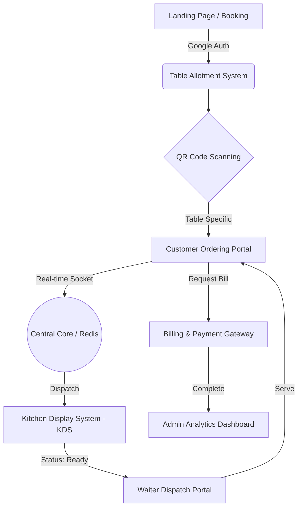

<div align="center">
  
  <h1>ORDR Smart Restaurant Operating System</h1>
  <p><em>The Next-Generation Digital Nervous System for Premium Dining Experiences</em></p>
  
  [](#)
  [](#)
  [](#)
  [](#)
  [](#)
  [](#)
  [](#)
  [](#)
</div>

---

## 📖 Executive Summary

**ORDR** is a full-scale, real-time operating system for premium restaurants. Designed with a dark-gold aesthetic, it seamlessly connects customers, waitstaff, and kitchen operations into a unified, high-performance ecosystem. 

By eliminating friction from table allotment to final payment, ORDR accelerates table turnover, reduces ordering errors, and provides deep operational analytics.

---

## 🏗️ Architectural Flow



---

## ✨ Feature Matrices

### 🛒 Customer Portal
| Feature | Description | Status |
| :--- | :--- | :---: |
| **QR Table Sync** | Auto-detects table number via scanned QR parameters | ✅ |
| **Real-time Cart** | Synchronized state across multiple devices at the same table | ✅ |
| **Live Tracking** | Visual progression from `Preparing` ➔ `Ready` ➔ `Served` | ✅ |
| **Waiter Paging** | 1-click requests for water, cutlery, or immediate assistance | ✅ |

### 👨‍🍳 Staff Portals (KDS & Waiter)
| Feature | Description | Status |
| :--- | :--- | :---: |
| **Ticket Triage** | Prioritize orders based on VIP status, time waited, or complexity | ✅ |
| **Bump System** | Kitchen staff can 'bump' items as completed to notify waiters | ✅ |
| **Zone Mapping** | Waiters assigned to specific floor zones for optimized routing | 🚧 |
| **Inventory Alert** | Auto-disable menu items when ingredients run low | 🚧 |

### ⚙️ Engine Infrastructure
| Feature | Description | Status |
| :--- | :--- | :---: |
| **WebSocket Core** | Sub-100ms latency for all inter-portal state updates | ✅ |
| **Redis Caching** | High-speed ephemeral state for carts and active sessions | ✅ |
| **Supabase DB** | Persistent storage for users, order history, and analytics | ✅ |
| **JWT RBAC** | Role-based access control (Admin, Waiter, Chef, Customer) | ✅ |

---

## 🗄️ System Architecture & Endpoints

| Layer | Technology | Primary Role |
| :--- | :--- | :--- |
| **Frontend** | React 18, Vite, Custom CSS (Dark/Gold) | UI/UX, Component State, Socket Handlers |
| **Backend** | Node.js, Express, Socket.io | API Routes, WebSocket Orchestration |
| **Cache** | Redis | Session state, Cart synchronization, Rate Limiting |
| **Database** | Supabase (PostgreSQL) | Persistent records, Auth, Row Level Security |

### Core API Endpoints

```http
POST   /api/v1/auth/google        # Authenticate users / staff
GET    /api/v1/menu               # Retrieve active menu items & categories
POST   /api/v1/orders             # Submit a new table order
PATCH  /api/v1/orders/:id/status  # Update order status (KDS/Waiter)
GET    /api/v1/analytics/daily    # Retrieve daily revenue & performance metrics
```

---

## 🚀 Setup & Local Run Guide

### 1. Prerequisites
- Node.js (v18+)
- Redis Server (Running locally or via Docker)
- Supabase Project (URL & Anon Key)

### 2. Environment Variables
Create a `.env` file in the root directory:
```env
VITE_SUPABASE_URL=your_supabase_url
VITE_SUPABASE_ANON_KEY=your_supabase_anon_key
VITE_API_URL=http://localhost:3000/api/v1
REDIS_URL=redis://localhost:6379
```

### 3. Installation
```bash
# Clone the repository
git clone https://github.com/your-org/ordr-restaurant-os.git
cd ordr-restaurant-os

# Install dependencies
npm install
```

### 4. Running the Ecosystem

You will need to start both the frontend Vite server and the backend Node server.

**Start the Development Server (Frontend):**
```bash
npm run dev
```
*Vite will start on `http://localhost:5173`*

**Start the Backend Server (Engine):**
```bash
npm run server:dev
```
*Express API & WebSocket server will start on `http://localhost:3000`*

---
<div align="center">
  <p>Built with precision for the modern restaurateur.</p>
</div>
