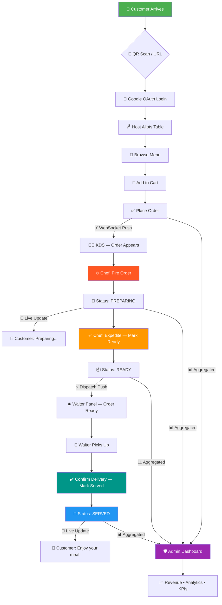

<!-- ============================================================ -->
<!--                  ORDR by Azzurro Caffè                      -->
<!--              Vibeathon 6.0 — Hackathon Project              -->
<!-- ============================================================ -->

<div align="center">

```
 ██████╗ ██████╗ ██████╗ ██████╗ 
██╔═══██╗██╔══██╗██╔══██╗██╔══██╗
██║   ██║██████╔╝██║  ██║██████╔╝
██║   ██║██╔══██╗██║  ██║██╔══██╗
╚██████╔╝██║  ██║██████╔╝██║  ██║
 ╚═════╝ ╚═╝  ╚═╝╚═════╝ ╚═╝  ╚═╝
     by  A Z Z U R R O  C A F F È
```

### 🔥 The Full-Stack Restaurant Command Center That **Ignites** Every Order

[](https://vibeathon6-0-one.vercel.app)
[](https://github.com)
[](https://react.dev)
[](https://nodejs.org)
[](https://supabase.com)
[](https://redis.io)

[](https://groq.com)
[](https://oauth.google.com)
[](https://railway.app)
[](https://vercel.com)
[](https://vibeathon6-0-one.vercel.app)

---

> **ORDR** doesn't just take orders — it **Orchestrates** the entire restaurant lifecycle.  
> From QR scan to plate delivery — every millisecond, **Dominated**.

</div>

---

## 🗺️ Table of Contents

- [⚡ What is ORDR?](#-what-is-ordr)
- [🎯 Live Demo & Credentials](#-live-demo--credentials)
- [🏗️ Architecture Overview](#️-architecture-overview)
- [🔄 Full Order Lifecycle](#-full-order-lifecycle)
- [🧑‍💻 Role-Based Access](#-role-based-access)
- [✨ Feature Arsenal](#-feature-arsenal)
- [🛠️ Tech Stack](#️-tech-stack)
- [🚀 Getting Started](#-getting-started)
- [📸 Screenshots](#-screenshots)
- [🤖 Jarvis — AI Waiter](#-jarvis--ai-waiter)
- [📊 Admin Intelligence Dashboard](#-admin-intelligence-dashboard)
- [🌐 Deployment](#-deployment)
- [🏆 Hackathon Context](#-hackathon-context)

---

## ⚡ What is ORDR?

**ORDR** is a **real-time, full-stack restaurant management system** built for Azzurro Caffè — a 100% pure vegetarian café experience — that **Propels** every step of the dining journey into the digital age.

Forget paper tickets. Forget yelling across the kitchen. ORDR **Unleashes** a seamless, role-aware command pipeline that connects **customers → kitchen → waiters → management** in a single, blazing-fast, WebSocket-powered platform.

> 🌿 **Pure Veg. Pure Tech. Pure Vibes.**

---

## 🎯 Live Demo & Credentials

<div align="center">

### 🌐 [https://vibeathon6-0-one.vercel.app](https://vibeathon6-0-one.vercel.app)

</div>

| 👤 Role | 📧 Email | 🔑 Password | 🎯 Access |
|---------|----------|-------------|-----------|
| 🛡️ **Admin** | `admin@azzurro.demo` | `password123` | Full system + analytics |
| 👨‍🍳 **Kitchen** | `kitchen@azzurro.demo` | `password123` | KDS — Fire & Expedite |
| 🛎️ **Waiter** | `waiter@azzurro.demo` | `password123` | Dispatch & Delivery |
| 🪑 **Host** | `host@azzurro.demo` | `password123` | Table allotment panel |
| 🧑‍💼 **Customer** | Google OAuth or `customer@azzurro.demo` | `password123` | Menu, cart, order tracking |

> 💡 **Fastest path:** Hit the live URL → Scan a QR → Sign in with Google → Order instantly.

---

## 🏗️ Architecture Overview

```
┌─────────────────────────────────────────────────────────────────────┐
│                        ORDR COMMAND CENTER                          │
│                      Azzurro Caffè — Vibeathon 6.0                  │
├─────────────────────────────────────────────────────────────────────┤
│                                                                     │
│  ┌──────────────┐    QR / URL     ┌──────────────────────────────┐  │
│  │   CUSTOMER   │ ──────────────▶ │   React + Vite  (Vercel)     │  │
│  │   (Browser)  │                 │   Landing → Auth → Menu      │  │
│  └──────────────┘                 └──────────────┬───────────────┘  │
│                                                  │  REST + WebSocket │
│  ┌──────────────┐                 ┌──────────────▼───────────────┐  │
│  │  KITCHEN KDS │ ◀─ realtime ──  │  Node.js / Express (Railway) │  │
│  │  (Chef View) │                 │  Auth · Orders · Analytics   │  │
│  └──────────────┘                 └──────┬──────────┬────────────┘  │
│                                          │          │               │
│  ┌──────────────┐              ┌─────────▼──┐  ┌────▼──────────┐   │
│  │ WAITER PANEL │ ◀─ dispatch  │  Supabase  │  │     Redis     │   │
│  │  (Dispatch)  │              │  DB + Auth │  │    Cache      │   │
│  └──────────────┘              │  Realtime  │  └───────────────┘   │
│                                └────────────┘                       │
│  ┌──────────────┐              ┌────────────┐                       │
│  │ ADMIN PANEL  │ ◀─ all data ─│  Groq API  │  (Jarvis AI Waiter)  │
│  │ (Dashboard)  │              │  LLM Chat  │                       │
│  └──────────────┘              └────────────┘                       │
│                                                                     │
└─────────────────────────────────────────────────────────────────────┘
```

---

## 🔄 Full Order Lifecycle



---

<details>
<summary><strong>🔥 Step-by-Step Flow Walkthrough (Click to Expand)</strong></summary>

<br>

### 🧑‍💼 Step 1 — Customer Journey

1. Customer visits **[https://vibeathon6-0-one.vercel.app](https://vibeathon6-0-one.vercel.app)**
2. Hits **"Reserve a Table"** or scans a **QR code** placed on the physical table
3. Redirected to **Google OAuth** — one-click sign-in, zero friction
4. Host Stand assigns a **table number** — customer is now seated digitally
5. The **full Azzurro menu** unfolds — curated pure veg delicacies, beautifully rendered
6. Customer adds items to cart, reviews, and **Executes** the order

---

### 👨‍🍳 Step 2 — Kitchen KDS (Fire & Expedite)

1. Order **slams** into the Kitchen Display System via WebSocket — **0ms delay**
2. Chef sees table number, items, quantity, and any special notes
3. Chef clicks **🔥 "Fire Order"** → Status flips to `PREPARING`
4. Customer's screen **instantly** shows `"Preparing your order..."`
5. Once plated, Chef clicks **⚡ "Expedite — Mark Ready"** → Status: `READY`
6. A **dispatch alert** fires to the Waiter panel

---

### 🛎️ Step 3 — Waiter Dispatch Panel

1. Order appears on the **Waiter Panel** with table number and items
2. Waiter physically picks up the order from kitchen
3. Clicks **✅ "Confirm Delivery & Mark Served"** → Status: `SERVED`
4. Customer's screen updates: **"Enjoy your meal! 🌿"**
5. Transaction recorded in admin analytics instantly

---

### 🛡️ Step 4 — Admin Command Center

1. Admin sees **every order across all tables** in real-time
2. Live **revenue counters**, **order throughput**, **avg prep time**
3. **Kitchen queue depth** — never let it pile up
4. **Waiter performance** — who's fastest, who's lagging
5. **Demand forecasting** — what dishes are trending right now
6. **Inventory signals** — stop selling what's running out

</details>

---

## 🧑‍💻 Role-Based Access

| 🎭 Role | 🔐 Auth Method | 🖥️ Panel | ⚡ Key Power |
|---------|---------------|----------|-------------|
| 👤 **Customer** | Google OAuth / Email | Menu + Cart + Order Tracker | Browse → Order → Track |
| 🪑 **Host** | Email + Password | Host Stand | Table Allotment + Seating |
| 👨‍🍳 **Kitchen** | Email + Password | KDS Screen | Fire + Expedite Orders |
| 🛎️ **Waiter** | Email + Password | Dispatch Panel | Confirm Delivery |
| 🛡️ **Admin** | Email + Password | Full Dashboard | **Dominate Everything** |

> 🔒 All routes are **JWT-protected**. Supabase Row-Level Security (RLS) enforces data isolation per role. No role can **Execute** outside its boundary.

---

## ✨ Feature Arsenal

<div align="center">

### 🚀 Every Feature Built to **Ignite** Your Dining Experience

</div>

| ⚡ Feature | 📝 Description |
|-----------|---------------|
| 📱 **QR Table Ordering** | Scan → Login → Order. No app download. Pure magic. |
| 🔥 **Live Kitchen Display (KDS)** | Real-time order queue, Fire & Expedite workflow |
| 🛎️ **Waiter Dispatch Panel** | Intelligent routing of ready orders to floor staff |
| 📊 **Admin Analytics Dashboard** | Revenue, demand forecasting, KPIs — all live |
| 🤖 **Jarvis AI Chatbot** | Groq-powered waiter that recommends, answers, charms |
| 🔐 **Google OAuth 2.0** | One-click login, zero password fatigue |
| ⚡ **WebSocket Order Tracking** | Sub-100ms status propagation across all screens |
| 🪑 **Smart Table Allotment** | Host Stand intelligently assigns & manages tables |
| 🌿 **100% Pure Veg Badge** | Trust signal baked into the UI fabric |
| 📈 **Revenue Analytics** | Real-time revenue counters + historical trends |
| 🔮 **Demand Forecasting** | AI-powered dish popularity prediction |
| 🏪 **Inventory Signals** | Track depletion, prevent overselling |
| 🎨 **Responsive UI** | Mobile-first design, works on any device |
| 🚄 **Redis Caching** | Lightning-fast menu loads, session management |

---

## 🛠️ Tech Stack

<div align="center">

### ⚡ Built on the Fastest Stack Imaginable

</div>

```
┌────────────────────────────────────────────────────────────┐
│                    FRONTEND  (Vercel)                      │
│  ⚛️  React 18          — Component-driven UI              │
│  ⚡  Vite              — Sub-second HMR dev experience     │
│  🎨  CSS Modules        — Scoped, conflict-free styles     │
│  🔗  React Router v6   — Client-side navigation           │
│  🔌  Native WebSocket  — Real-time order tracking          │
└────────────────────────────────────────────────────────────┘

┌────────────────────────────────────────────────────────────┐
│                    BACKEND  (Railway)                      │
│  🟢  Node.js / Express — REST API + WebSocket server      │
│  🔐  Supabase Auth     — JWT + Google OAuth provider      │
│  🗄️  Supabase DB       — PostgreSQL + Realtime subs       │
│  🔴  Redis             — Caching, sessions, rate-limiting  │
│  🤖  Groq API          — Jarvis LLM chatbot backbone      │
└────────────────────────────────────────────────────────────┘

┌────────────────────────────────────────────────────────────┐
│                   INFRASTRUCTURE                           │
│  ▲   Vercel            — Frontend CDN + Edge Network      │
│  🚂  Railway           — Backend auto-scaling PaaS        │
│  🔵  Supabase          — Auth + DB + Realtime managed     │
│  🔴  Redis Cloud       — Managed Redis instance           │
└────────────────────────────────────────────────────────────┘
```

---

## 🚀 Getting Started

### Prerequisites

```bash
Node.js >= 18.x
npm >= 9.x
Supabase account (free tier works)
Redis instance (Redis Cloud / local)
Groq API key
Google OAuth credentials
```

### 1️⃣ Clone & Install

```bash
git clone https://github.com/mohammed-shaz9/Vibeathon6.0.git
cd Vibeathon6.0

# Install frontend deps
cd client && npm install

# Install backend deps
cd ../server && npm install
```

### 2️⃣ Configure Environment

**`server/.env`**
```env
PORT=3001
SUPABASE_URL=your_supabase_project_url
SUPABASE_SERVICE_ROLE_KEY=your_service_role_key
REDIS_URL=redis://localhost:6379
GROQ_API_KEY=your_groq_api_key
GOOGLE_CLIENT_ID=your_google_oauth_client_id
GOOGLE_CLIENT_SECRET=your_google_oauth_client_secret
JWT_SECRET=your_super_secret_jwt_key
```

**`client/.env`**
```env
VITE_SUPABASE_URL=your_supabase_project_url
VITE_SUPABASE_ANON_KEY=your_supabase_anon_key
VITE_API_URL=http://localhost:3001
VITE_GOOGLE_CLIENT_ID=your_google_oauth_client_id
```

### 3️⃣ Fire It Up 🔥

```bash
# Terminal 1 — Backend
cd server && npm run dev

# Terminal 2 — Frontend
cd client && npm run dev
```

> 🌐 Frontend: `http://localhost:5173` | 🟢 Backend: `http://localhost:3001`

### 4️⃣ Supabase Setup

Run the SQL migrations in `/server/supabase/migrations/` in order. RLS policies are included — just **Execute** and go.

---

## 📸 Screenshots

<div align="center">

| 🏠 Landing Page | 📖 Menu View |
|:-:|:-:|
| *(screenshot placeholder)* | *(screenshot placeholder)* |

| 🔥 Kitchen KDS | 🛎️ Waiter Panel |
|:-:|:-:|
| *(screenshot placeholder)* | *(screenshot placeholder)* |

| 📊 Admin Dashboard | 🤖 Jarvis Chat |
|:-:|:-:|
| *(screenshot placeholder)* | *(screenshot placeholder)* |

</div>

> 💡 Add screenshots to `/docs/screenshots/` and link them above for maximum README impact.

---

## 🤖 Jarvis — AI Waiter

<div align="center">

```
  ╔═══════════════════════════════════╗
  ║   👋 Hi! I'm JARVIS              ║
  ║   Your AI-powered Azzurro waiter  ║
  ║                                   ║
  ║   Ask me anything:               ║
  ║   "What's today's special?"      ║
  ║   "I'm lactose intolerant"       ║
  ║   "Recommend something spicy"    ║
  ║   "How long is my order?"        ║
  ╚═══════════════════════════════════╝
```

</div>

**Jarvis** is a **Groq-powered** conversational AI embedded directly into the customer ordering flow. It:

- 🍽️ **Recommends** dishes based on preferences and dietary restrictions
- ⏱️ **Informs** customers about estimated prep times
- 🌿 **Navigates** the pure veg menu intelligently
- ❓ **Answers** any restaurant or menu-related question
- 🧠 **Learns** from the conversation context — not just keywords

> Built on **Groq's ultra-fast inference** — responses in `<500ms`. Feels like magic.

---

## 📊 Admin Intelligence Dashboard

The admin panel doesn't just display data — it **Commands** it.

<details>
<summary><strong>📈 Analytics Breakdown (Click to Expand)</strong></summary>

<br>

| 📊 Metric | 📝 Description | 🔄 Refresh Rate |
|----------|---------------|----------------|
| 💰 **Live Revenue** | Running total across all active orders | Real-time |
| 📦 **Order Throughput** | Orders per hour, trend graph | Every 30s |
| ⏱️ **Avg Prep Time** | Kitchen efficiency benchmark | Per-order |
| 🍽️ **Top Dishes** | Best-selling items right now | Real-time |
| 🔮 **Demand Forecast** | Predicted order volume next 2 hours | Every 5min |
| 👨‍🍳 **Kitchen Queue Depth** | Pending + in-progress orders | Real-time |
| 🛎️ **Waiter Performance** | Deliveries per waiter, avg time | Per-shift |
| 🏪 **Inventory Signals** | Depletion warnings, low-stock alerts | Per-order |

</details>

---

## 🌐 Deployment

### Frontend → Vercel

```bash
cd client
npm run build
# Push to GitHub — Vercel auto-deploys on every push to main
```

### Backend → Railway

```bash
# Connect your GitHub repo to Railway
# Set environment variables in Railway dashboard
# Railway auto-deploys on push to main
# WebSocket connections are fully supported
```

### Supabase

- Enable **Realtime** on `orders` table
- Set up **Row Level Security** policies from `/server/supabase/migrations/`
- Configure **Google OAuth** provider in Supabase Auth settings

---

## 🏆 Hackathon Context

<div align="center">

```
╔══════════════════════════════════════════════════════════╗
║                                                          ║
║              🏆  VIBEATHON 6.0  🏆                      ║
║                                                          ║
║   Team:     CODE WIZARDS                         ║
║   Project:  ORDR by Azzurro Caffè                        ║
║   Theme:    Real-world SaaS that Dominates               ║
║   Stack:    Full-stack · AI · Real-time · Cloud          ║
║                                                          ║
╚══════════════════════════════════════════════════════════╝
```

</div>

**ORDR** was conceived, designed, and **Executed** during Vibeathon 6.0 — a high-intensity hackathon that demanded real products, not demos. We didn't build a toy. We built something a restaurant could **deploy tomorrow**.

Every design decision was made to **Propel** real operational efficiency:

- ✅ No paper tickets
- ✅ No miscommunication between kitchen and floor
- ✅ No manual revenue tallying
- ✅ No customers left in the dark about their order

> "We didn't just code — we **Ignited** a new standard for restaurant tech."

---

## 🤝 Contributing

```bash
# Fork the repo
# Create your feature branch
git checkout -b feature/your-awesome-feature

# Commit your changes
git commit -m "feat: Ignite [feature-name]"

# Push and open a PR
git push origin feature/your-awesome-feature
```

> All PRs reviewed within 24h. We move fast. **Execute** with quality.

---

## 📄 License

```
MIT License — Use it, fork it, ship it.
Just give Azzurro Caffè the credit it deserves. 🌿
```

---

<div align="center">

### Built with 🔥 by the Azzurro Team at Vibeathon 6.0

[](https://vibeathon6-0-one.vercel.app)

```
🌿 100% Pure Veg. ⚡ 100% Real-time. 🔥 100% Vibeathon.
```

*Every order. Every second. **Orchestrated**.*

</div>
