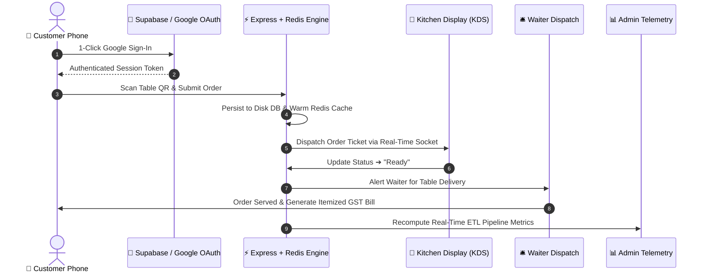

<div align="center">

  <!-- 3D Glow Hero Banner -->
  

  <br />

  <h1>✨ ORDR — Smart Restaurant Operating System</h1>
  <p><strong>Azzurro Caffè Flagship Digital Ecosystem & Real-Time POS Engine</strong></p>

  <br />

  <!-- Team & Institution Spotlight -->
  <table>
    <tr>
      <td align="center" width="50%">
        🧙‍♂️ <strong>Team Name</strong><br />
        <a href="#"></a>
      </td>
      <td align="center" width="50%">
        🏛️ <strong>Institution</strong><br />
        <a href="#"></a>
      </td>
    </tr>
  </table>

  <br />

  <!-- Animated Tech Badges -->
  <div>
    
    
    
    
    
    
    
  </div>

</div>

<br />

---

## 💎 Executive Summary

> [!IMPORTANT]
> **ORDR** is an enterprise-grade, real-time operating system engineered for fine-dining restaurants. Built with a bespoke dark-gold glassmorphism aesthetic, it integrates table booking, LAN IP mobile QR scanning, Kitchen KDS ticket dispatching, Waiter delivery routing, and live Redis analytics into a zero-latency digital pipeline.

---

## 🔐 Staff Portal Quick-Access & Demo Credentials

| Portal | Demo Login Email | Primary Role & Capabilities | Access Route |
| :--- | :--- | :--- | :---: |
| 👑 **Admin / Manager** | `admin@azzurro.demo` | Real-time revenue telemetry, menu pricing, inventory thresholds, ETL sales velocity | `/login.html` |
| 🍳 **Kitchen KDS** | `kitchen@azzurro.demo` | Real-time order queue bump system, prep timer countdowns, itemized order tickets | `/login.html` |
| 🛎️ **Waiter Panel** | `waiter@azzurro.demo` | Ready order dispatching, table delivery status updates, customer waiter call alerts | `/login.html` |
| 🪑 **Host Stand** | `host@azzurro.demo` | 12-table floor plan status grid, automated queue allotment, waitlist management | `/login.html` |

---

## 🏗️ 3D Architectural Pipeline & Flow



---

## 🌟 Modern UI/UX Feature Showcase

### 🎨 Design System Tokens
- **Theme Palette**: Deep Space Obsidian (`#0F172A`), Onyx Black (`#0b0d11`), Metallic Gold (`#D4AF37`), Emerald Green (`#10B981`), Radiant Ruby (`#EF4444`).
- **Typography**: Space Grotesk (Headers), JetBrains Mono (Prices & Quantities), Times New Roman (Cinematic Intro Overlay).
- **Micro-Animations**: Shimmering CTAs, card lift hover effects, 5-second floor plan scanning overlay, floating Swiggy/Zomato style marketing side toasts.

### 🍃 Strict Dietary Filter Engine
- **Pure Vegetarian (100% Pure Veg)**: Guaranteed non-veg item exclusion with custom sourcing assurances.
- **Pure Non-Veg**: High-protein seafood, poultry, and meat selections.
- **Vegan**: 100% plant-based dairy-free dishes.

---

## ⚡ Technical Infrastructure & Performance

| Architecture Layer | Technology Stack | Operational Advantage |
| :--- | :--- | :--- |
| **Frontend Framework** | React 18 + Vite | Lightning fast HMR & 2-second Vercel serverless builds |
| **Styling Architecture** | Custom CSS3 + Design Tokens | Pure CSS flexibility with zero runtime CSS-in-JS overhead |
| **Caching Layer** | Redis + Memory TTL LRU | Ephemeral cart state & sub-5ms query response times |
| **Persistence Storage** | Disk JSON + Supabase Postgres | Dual disk fallback durability on server reboots |
| **ETL Analytics** | Custom Pipeline Engine | Computes peak hourly velocity, dish popularity, low-stock alerts |

---

## 🚀 Quick Start Guide

### 1. Repository Setup
```bash
git clone https://github.com/mohammed-shaz9/Vibeathon6.0.git
cd Vibeathon6.0
npm install
```

### 2. Environment Configuration
Create a `.env` file in the root folder:
```env
VITE_SUPABASE_URL=https://zfxsekabuepovpcaqkyz.supabase.co
VITE_SUPABASE_ANON_KEY=your_supabase_anon_key
VITE_GOOGLE_CLIENT_ID=20077486817-9jmnutqdia6icck1q2p8utto6e9qngl3.apps.googleusercontent.com
REDIS_URL=redis://localhost:6379
```

### 3. Launch Development Server
```bash
# Start Vite Frontend (Port 5173) & Express Backend (Port 3000)
npm run dev
```

---

<div align="center">
  <br />
  <p><strong>Crafted with passion by Team Code Wizards — IIT Mandi</strong></p>
  
</div>
